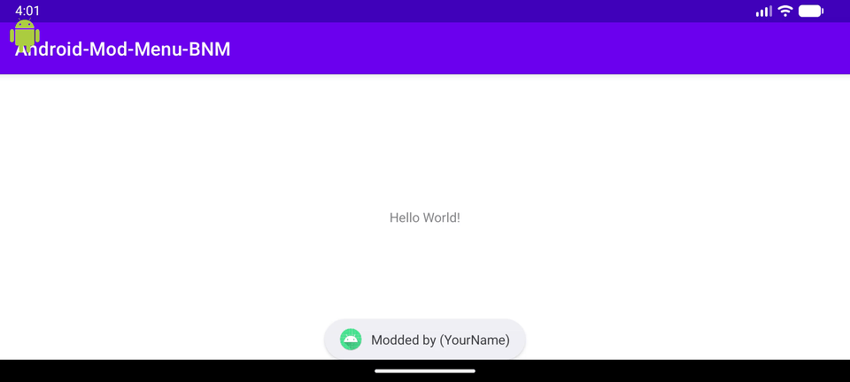
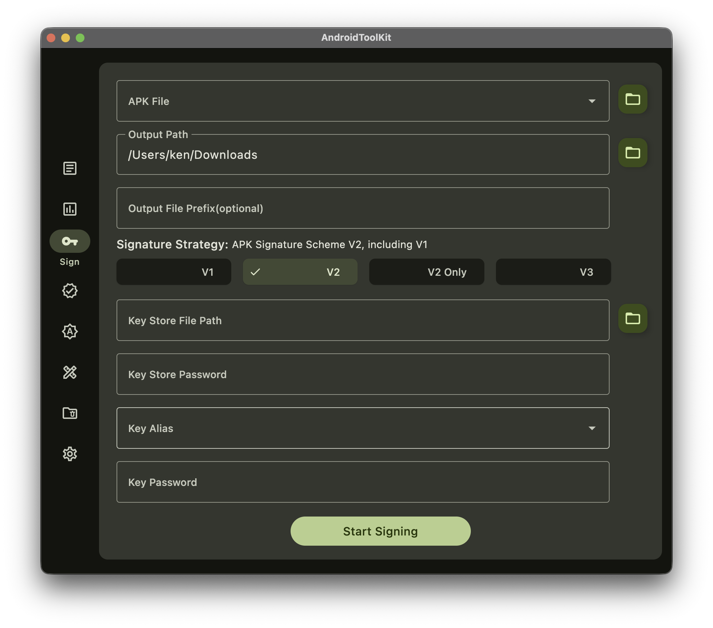

# Introduction

Floating mod menu for il2cpp base on [ByNameModding](https://github.com/ByNameModding/BNM-Android)



# Getting Start

## Edit and Build Android-Mod-Menu-BNM with [Android Studio](https://developer.android.com/studio)

1. edit `app/com/android/support/Menu.kt`

   ```kotlin
   const val TITLE = "Modded by (YourName)"
   const val SUB_TITLE = "whatever here"
   const val START_ICON = "data:image/png;base64,..."
   ```

2. edit `app/cpp/native-lib.cpp`

   ```cpp
   // feature list
   getFeatureList() {}

   // value change
   valueChange() {}

   // hook methods
   OnLoaded() {}
   ```

3. build `app-debug.apk`

   ```
   Build > Generate App Bundles or APKs > Generate APKs
   ```

## Decoding `app-debug.apk` with [apktool](https://apktool.org/)

```zsh
apktool d -f app-debug.apk
```

## Decoding `game.apk` with [apktool](https://apktool.org/)

```zsh
apktool d -f game.apk
```

## Copy `app-debug` files to `game` fold

```zsh
cp app-debug/lib/${ARCH_ABI}/libModBNM.so game/lib/${ARCH_ABI}/libModBNM.so
cp -r app-debug/smali_classes* game/
```

## Update `game`'s main activity

1. find `main` activity in `game/AndroidManifest.xml`

   ```xml
    <activity android:name="com.unity3d.player.UnityPlayerActivity">
        <intent-filter>
            <category android:name="android.intent.category.LAUNCHER"/>
            <action android:name="android.intent.action.MAIN"/>
        </intent-filter>
        <intent-filter>
            <category android:name="android.intent.category.DEFAULT"/>
            <category android:name="android.intent.category.BROWSABLE"/>
            <data android:host="callback" android:path="/param" android:scheme="com.greent.hornymerge"/>
            <action android:name="android.intent.action.VIEW"/>
        </intent-filter>
        <meta-data android:name="unityplayer.UnityActivity" android:value="true"/>
    </activity>
   ```

2. edit `onCreate` method in `game/smali/com/unity3d/player/UnityPlayerActivity.smali`

   ```smali
   .method protected onCreate(Landroid/os/Bundle;)V
       # invoke Main.start(context)
       invoke-static {p0}, Lcom/android/support/Main;->start(Landroid/content/Context;)V
       ...
   .end method
   ```

## Rebuilding `game` with [apktool](https://apktool.org/)

```zsh
apktool b -f game
```

## Sign `game/dist/game.apk` with [AndroidToolKit](https://github.com/LazyIonEs/AndroidToolKit/) or [apksigner](https://developer.android.com/tools/apksigner)



# Credits

- [Android-Mod-Menu](https://github.com/LGLTeam/Android-Mod-Menu) Floating mod menu for il2cpp and
  other native android games.
- [ByNameModding](https://github.com/ByNameModding/BNM-Android) Modding il2cpp games by classes,
  methods, fields names on Android.
- [Dobby](https://github.com/jmpews/Dobby) a lightweight, multi-platform, multi-architecture hook framework.
